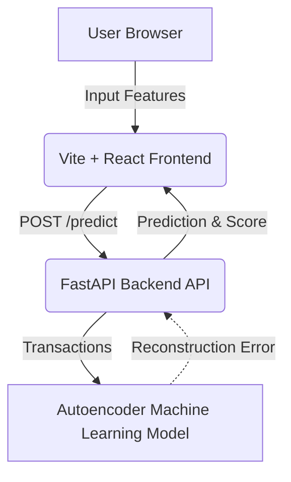

# Smart Fraud Detection System using Autoencoders

A complete deployment-ready fraud detection project utilizing an Autoencoder anomaly detection model.

## System Architecture



## Tech Stack
- **Frontend**: Vite, React, Vanilla CSS (Glass-morphism UI)
- **Backend API**: Python, FastAPI, Uvicorn, Pydantic
- **Machine Learning**: TensorFlow (Keras), Scikit-Learn, Pandas, NumPy

## Dataset Source
This project uses the **Credit Card Fraud Detection Dataset from Kaggle**.
1. Go to Kaggle: [Credit Card Fraud Detection](https://www.kaggle.com/datasets/mlg-ulb/creditcardfraud)
2. Download the dataset and place the `creditcard.csv` file inside `backend/data/raw/`.

---

## 🚀 Setup & Run Locally

### 1. Backend Setup (FastAPI & ML)

Open a terminal and build the backend:

```bash
cd backend

# Create virtual environment (Python 3.10+)
python -m venv venv

# Activate virtual environment
# On Windows:
venv\Scripts\activate
# On Mac/Linux:
# source venv/bin/activate

# Install dependencies
pip install -r requirements.txt

# Train the Autoencoder and generate the model
python -m src.training_pipeline
```
*(Make sure `creditcard.csv` is in `backend/data/raw/` before running the training script!)*

**Start the FastAPI Server:**
```bash
uvicorn api.main:app --reload
```
The backend API documentation is now available at [http://localhost:8000/docs](http://localhost:8000/docs).

### 2. Frontend Setup (React App)

Open a **second** terminal for the frontend:

```bash
cd frontend

# Install Vite React dependencies
npm install

# Start the React development server
npm run dev
```
The web app is now available at [http://localhost:5173](http://localhost:5173).

---

## 🌐 Deployment Guide (Deploy Online)

To deploy this project online, you will host the backend and frontend separately.

### Deploying the Backend (Render or Railway)
Because the backend uses Python and FastAPI, we recommend Render.com or Railway.app.

#### Render:
1. Push your repository to GitHub.
2. In Render, select **New -> Web Service**.
3. Connect your GitHub repo.
4. Settings:
   - Root Directory: `backend`
   - Build Command: `pip install -r requirements.txt`
   - Start Command: `uvicorn api.main:app --host 0.0.0.0 --port $PORT`
5. *Note: Pre-train the model locally and commit the `backend/models/autoencoder_model.h5` and `threshold.txt` so the server has the model ready, or add code to download it dynamically.*

### Deploying the Frontend (Vercel or Netlify)
The React app is a static site and can be perfectly hosted on Vercel.

#### Vercel:
1. In Vercel, select **Add New -> Project**.
2. Connect the same GitHub repo.
3. Settings:
   - Framework Preset: `Vite`
   - Root Directory: `frontend`
   - Environment Variables: Set `VITE_API_BASE_URL` if you modified `api.js` to use an environment variable (pointing to your newly deployed Render API URL!).
4. Click Deploy.

---
